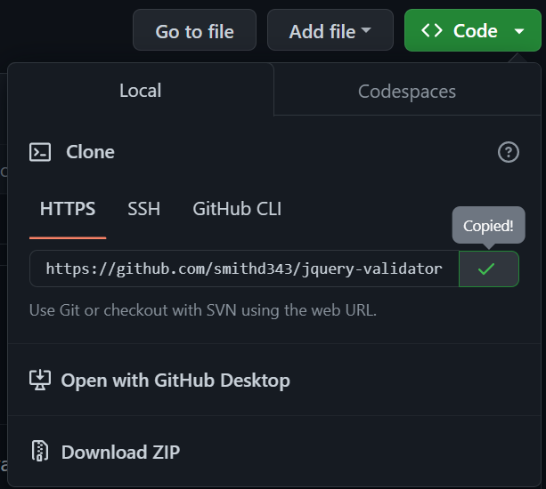

# Exercise 2 - Clone Repository

Clone a repository to your local environment.

## Steps

1. Start [Git Bash](https://git-scm.com/downloads), [Visual Studio Code](https://code.visualstudio.com/), or [Visual Studio](https://visualstudio.microsoft.com/vs/)

2. Select a good location for local repositories, examples include `C:\Users\[username]\Repos` or `C:\Users\[username]\Source`

    Hint: Open Windows Explorer with `Windows Key + E` and type `%USERPROFILE%` into the address bar to quickly access your user area

3. Use the appropriate method for the tool you are using to clone the following repository:

       https://github.com/smithd343/jquery-validator

    Hint: the URL you need is under the **Code** section:

    

4. Access the local repository and confirm everything has been cloned
